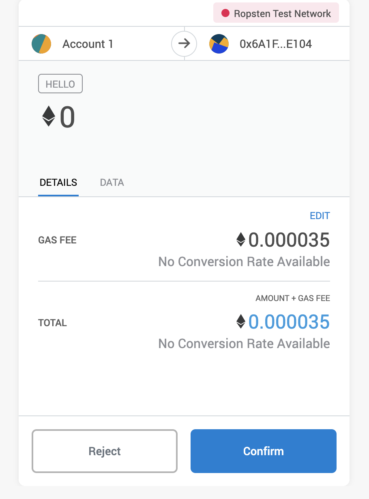
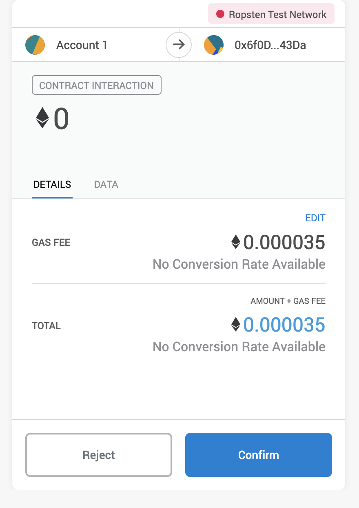

# Overview

> 🏆 1st Place Winner of TruffleCon 2019 Hackathon!!! 🎉🎉🎉

This plugin allows truffle to scan your contract build artifacts for non-constant methods and register them in the Parity Signature Registry smart contract.

By doing this, web3 browsers can use this information to show some user friendly info to the user when calling contract methods.

Currently Metamask uses this registry as explained in https://metamask.github.io/metamask-docs/Best_Practices/Registering_Function_Names, but there is too much friction. This plugin aims to incentivize people to start registering their contract functions.

# TLDR;

```sh
$ export TRUFFLE_PLUGIN_MNEMONIC="<YOUR-SECRET-MAINNET-MNEMONIC-HERE>"
$ npx truffle run register-methods <contract-name>
```

# Usage Tutorial

Let's create a sample truffle project containing a Hello World contract and register its methods using this plugin.

> We'll deploy the artifacts on Ropsten testnet, but register the functions in Mainnet since this is where Metamask always read metadata from according to their documentation.

First, let's create the truffle project:

```sh
$ md sample-contract && sample-contract
$ npm init -y
$ npm i -D truffle truffle-plugin-register-methods truffle-hdwallet-provider
$ npx truffle init
```

Edit the `truffle-config.js` file and add the following configuration to `module.exports` just after the `compilers` config:

```json
plugins: ["truffle-plugin-register-methods"]
```

Add the following configuration for Ropsten network inside the `networks` section:

```json
ropsten: {
    provider: () => new HDWalletProvider(process.env.ROPSTEN_MNEMONIC, `<YOUR-ROPSTEN-ENDPOINT>`),
    network_id: 3,
    gas: 5500000
},
```

> Create a project in Infura and get your own endpoint URL for Ropsten network. Paste it into `<YOUR-ROPSTEN-NETWORK>`. Don't forget the `https://` prefix!

Add a file called `HelloWorld.sol` inside `./contracts` directory with the following contents:

```js
pragma solidity ^0.5;

contract HelloWorld {
    function hello(address someAddress, uint256 someValue) public {
    }
}
```

Replace the **entire** contents of `./migrations/1_initial_migration.js` file with the following:

```js
const HelloWorld = artifacts.require("HelloWorld");

module.exports = function(deployer) {
  deployer.deploy(HelloWorld);
};
```

Export your Ropsten network secret mnemonic phrase into an environment variable called `ROPSTEN_MNEMONIC`:

```sh
$ export ROPSTEN_MNEMONIC="<YOUR-SECRET-ROPSTEN-MNEMONIC-HERE>"
```

Compile and deploy:

```
$ npx truffle compile
$ npx truffle migrate --network ropsten
```

It should output something like this:

```
1_initial_migration.js
======================

   Deploying 'HelloWorld'
   ----------------------
   > transaction hash:    0x062ec4cc6a1beb872c0fe74e1352aa759541f8f965fe8dbe3a4211ca3490458c
   > Blocks: 0            Seconds: 41
   > contract address:    0x6A1Fc3592615EdB286108a932b99F251bC9aE104
   > block number:        6172577

<other not important stuff...>
```

Take note of the contract address, we'll use it to test if the function registration was successful.

Now go to the https://oneclickdapp.com and create a sample dapp to interact with our just deployed contract.

In the address field, paste the address from truffle output. In the interface ABI, paste the HelloWorld  contract ABI. You should be able to get it easily from the compiled artifacts by running:

```sh
$ cat build/contracts/HelloWorld.json | jq ".abi"
```

The configuration should look like this:


Finish the dapp creation and you should see a simple UI where you can call the `hello` method from the smart contract with some parameters. Enter some random values and call `Sign and Submit`:


Metamask should display a popup with the `hello` method name, even though we had not registered anything yet with the plugin. That is because I have already done it myself before for this tutorial 😃



Now let's see the plugin in action. First, open the `HelloWorld.sol` file and change the `hello` function name to something totally random, in my example I'll try `hello_world_23123`.

Let's recompile and redeploy every from scratch:

```
$ npx truffle compile
$ npx truffle migrate --network ropsten --reset
```

You'll get another contract address since we'd redeployed the HelloWorld contract from scratch. Create another dapp from scratch using oneclickdapp, note that the contract address and ABI will be different this time.

You should get something like this:


And if you sign and submit and function, the function name will not be recognized, you'll get a generic "Contract Interaction" message:



Let's now register our function signature in Mainnet. For this to happen we'll have to spend some real ETH to pay the gas.

Export a seed phrase with some small amount of ETH as an environment variable called `TRUFFLE_PLUGIN_MNEMONIC` and run the plugin:

```sh
$ export TRUFFLE_PLUGIN_MNEMONIC="<YOUR-SECRET-MAINNET-MNEMONIC-HERE>"
$ npx truffle run register-methods HelloWorld
```

In case of success it should output something like this:

```sh
Getting contract functions...
hello_world_23123 => processing
	Signature: hello_world_23123(address,uint256)
	Selector: 0xfada1e0b
	Method not found in the registry, trying to register...

****************************
Waiting for registration transactions to complete...
	hello_world_23123(address,uint256) => https://etherscan.io/tx/0x52b566d47712aa69b71ba73573f796463ad33d5719bed16f5d28e62174844592
Registration complete! 🎉🎉🎉🎉🎉
```

> The plugin will scan all non-constant function in the smart contract, calculate the function selector, check if it is already registered, and if it is not, try to register it.

Now if we try to call the function again in oneclickdapp, we should see the name is resolved (you may need to restart the browser for Metamask to recognize the change):

