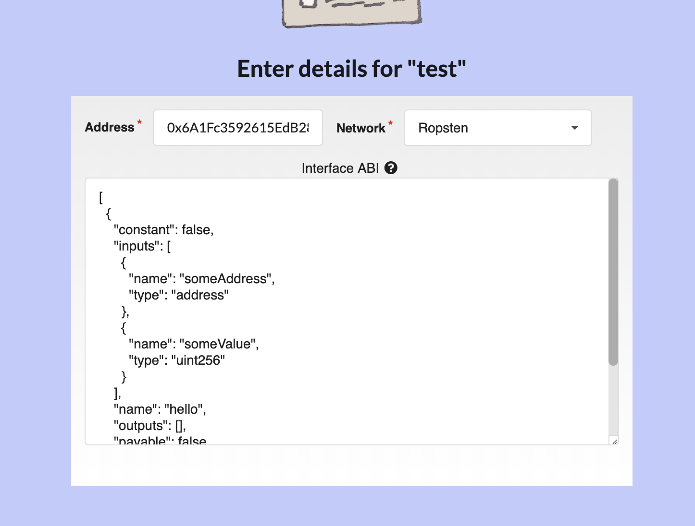
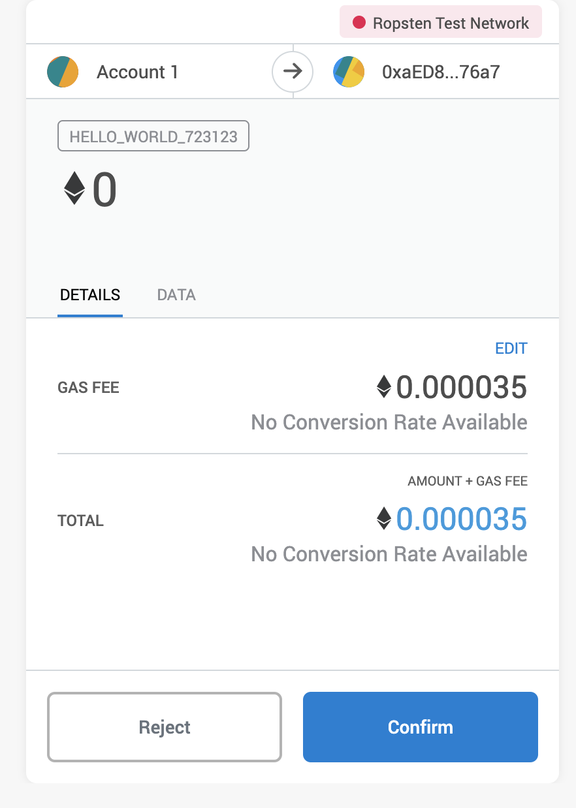
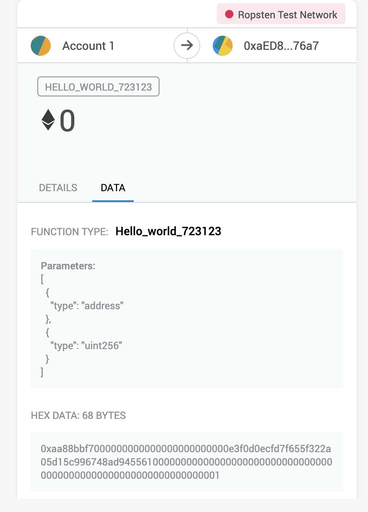

# Usage

## Prerequisites

1. Create a project in https://infura.io and get your own endpoint URL for Ropsten network. You'll need it later for deploying your sample contract.

2. Get a seedphrase for a Ropsten account with some testnet ETH. You'll need it to pay for the gas for contract deployment.

3. Get a seedphrase for a Mainnet account with some real ETH. You'll need it to pay for the gas for method signature registration.

## Tutorial

Let's create a sample truffle project containing a `HelloWorld` contract and register its methods using this plugin.

> We'll deploy the artifacts on Ropsten testnet, but register the functions in Mainnet since this is where Metamask always read metadata from according to their documentation.

First, let's create the truffle project:

```sh
$ md sample-contract && sample-contract
$ npm init -y
$ npm i -D truffle truffle-plugin-register-methods truffle-hdwallet-provider
$ npx truffle init
```

Edit the `truffle-config.js` file and add the following configuration to `module.exports` just after the `compilers` config:

```json
plugins: ["truffle-plugin-register-methods"]
```

Add the following configuration for Ropsten network inside the `networks` section:

```js
ropsten: {
    provider: () => new HDWalletProvider(process.env.ROPSTEN_MNEMONIC, `<YOUR-ROPSTEN-ENDPOINT>`),
    network_id: 3,
    gas: 5500000
},
```

> Replace `<YOUR-ROPSTEN-NETWORK>` with your Infura Ropsten endpoint. Don't forget the `https://` prefix!

Add a file called `HelloWorld.sol` inside `./contracts` directory with the following contents:

```js
pragma solidity ^0.5;

contract HelloWorld {
    function <RANDOM-FUNCTION-NAME>(address someAddress, uint256 someValue) public {
    }
}
```

> Replace <RANDOM-FUNCTION-NAME> with some random valid solidity function name. Ensure to give it some random name as it may colide with other names from other users following this tutorial.

Replace the **entire** contents of `./migrations/1_initial_migration.js` file with the following:

```js
const HelloWorld = artifacts.require("HelloWorld");

module.exports = function(deployer) {
  deployer.deploy(HelloWorld);
};
```

Export your Ropsten seedphrase as an environment variable:

```sh
$ export ROPSTEN_MNEMONIC="<YOUR-SECRET-ROPSTEN-MNEMONIC-HERE>"
```

> Replace `<YOUR-SECRET-ROPSTEN-MNEMONIC-HERE>` with your Ropsten seedphrase.

Compile and deploy:

```
$ npx truffle compile
$ npx truffle migrate --network ropsten
```

It should output something like this:

```
1_initial_migration.js
======================

   Deploying 'HelloWorld'
   ----------------------
   > transaction hash:    0x062ec4cc6a1beb872c0fe74e1352aa759541f8f965fe8dbe3a4211ca3490458c
   > Blocks: 0            Seconds: 41
   > contract address:    0x6A1Fc3592615EdB286108a932b99F251bC9aE104
   > block number:        6172577

<other not important stuff...>
```

Take note of the contract address, we'll use it to test if the function registration was successful.

Let's now register our function signature in Mainnet. For this to happen we'll have to spend some real ETH to pay the gas.

Export a seed phrase with some small amount of ETH as an environment variable called `TRUFFLE_PLUGIN_MNEMONIC` and run the plugin:

```sh
$ export TRUFFLE_PLUGIN_MNEMONIC="<YOUR-SECRET-MAINNET-MNEMONIC-HERE>"
$ npx truffle run register-methods HelloWorld
```

> Replace `<YOUR-SECRET-MAINNET-MNEMONIC-HERE>` with your Mainnet seedphrase.

In case of success it should output something like this:

```sh
Getting contract functions...
hello_world_23123 => processing
	Signature: hello_world_23123(address,uint256)
	Selector: 0xfada1e0b
	Method not found in the registry, trying to register...

****************************
Waiting for registration transactions to complete...
	hello_world_23123(address,uint256) => https://etherscan.io/tx/0x52b566d47712aa69b71ba73573f796463ad33d5719bed16f5d28e62174844592
Registration complete! 🎉🎉🎉🎉🎉
```

> The plugin will scan all non-constant function in the smart contract, calculate the function selector, check if it is already registered, and if it is not, try to register it.

Now go to the https://oneclickdapp.com and create a sample dapp to interact with our just deployed contract.

In the address field, paste the address from truffle output. In the interface ABI, paste the HelloWorld  contract ABI. You should be able to get it easily from the compiled artifacts by running:

```sh
$ cat build/contracts/HelloWorld.json | jq ".abi"
```

The configuration should look like this:



Finish the dapp creation and you should see a simple UI where you can call your function from the smart contract with some parameters. Enter some random values and call `Sign and Submit`:


Metamask should display a popup with your function name and some parameter details in the data tab:




